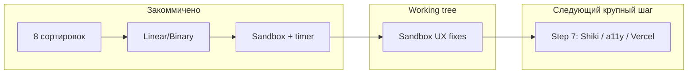

# Состояние AlgoVisual vs ТЗ и roadmap

> Актуализировано: 2026-08-27 20:22 · сверка с `git log` (`672e32e`, `5fc3b70`, `6e05a20`).

**Режим:** staged delivery — один шаг → ревью/commit → отмашка → следующий.

**Источник требований:** [Перезапуск изучения алгоритмов.md](c:\Users\mari_banana\Documents\GitHub\Перезапуск изучения алгоритмов.md). Handoff: `PROJECT_STATUS.md`.

---

## Коммиты (факты)

- `672e32e` — ✨ feat(searching): Linear/Binary + SearchVisualizer
- `5fc3b70` — ✨ feat(sandbox): side-by-side comparison
- `6e05a20` — ✨ feat(player): real-time elapsed timer (ms)
- `main` ahead of `origin/main` by 1 (timer) — остальное уже на remote

---

## Порядок шагов

1–6. ~~Done (в т.ч. timer)~~
6+. Sandbox UX fixes — **код готов → ревью/commit**
7. Shiki, адаптив, a11y, README, Vercel ← после отмашки
8–10. Полный каталог → CSS-арт + квиз → 3D

Целевой scope — **роскошный максимум**.

---

## Решения

| Решение | Зачем |
|---------|--------|
| Same category only в sandbox | Честное сравнение на одном типе задачи |
| `moves` = swap\|insert\|merge | Merge/Counting не делают swap |
| Binary hint только при binary | Не засорять UI сортировок |
| 3D в конце | ТЗ / staged delivery |

---

## Чек-лист

### Сейчас
- [ ] Ревью sandbox UX fixes
- [ ] Commit
- [ ] Push timer (+ fixes) при желании

### Step 7
- [ ] Shiki в CodeBlock
- [ ] a11y + финальный адаптив
- [ ] README
- [ ] Vercel

### Steps 8–10
- [ ] Полный каталог / CSS-арт+квиз / 3D
