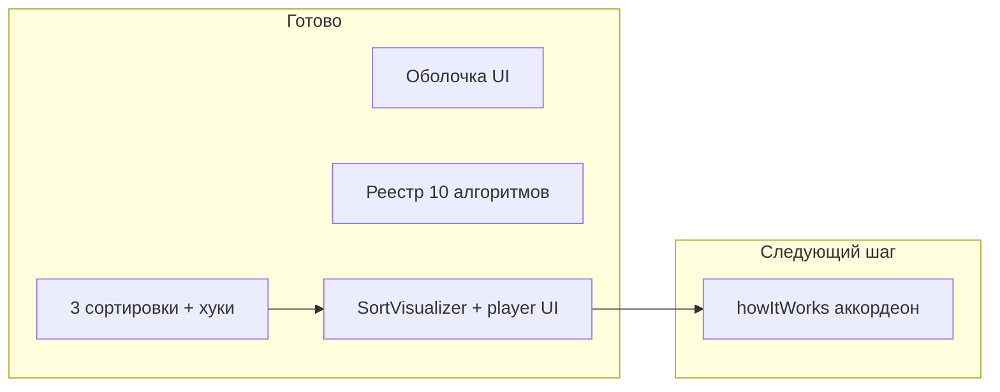

# Состояние AlgoVisual vs ТЗ и roadmap

**Режим работы:** staged delivery — один шаг → ревью/commit → отмашка → следующий.

**Важно:** приложенный [algovisual_roadmap](c:\Users\mari_banana.cursor\plans\algovisual_roadmap_6a8cc470.plan.md) **устарел** относительно кода. Источник требований: [Перезапуск изучения алгоритмов.md](c:\Users\mari_banana\Documents\GitHub\Перезапуск изучения алгоритмов.md).

---

## Что требует ТЗ (сжато)

- Учебник с Big O, карточками категорий, страницей `/algorithm/:slug` (визуализатор слева, аккордеон справа, код снизу, кнопка 3D).
- Песочница `/sandbox?a=&b=` — side-by-side сравнение.
- Clean Architecture: чистый TS в `algorithms/`, генераторы шагов, React только рендерит `currentStep`.
- По алгоритму: как работает, Big O, когда использовать, 3 варианта кода, визуализация, тесты.
- Стек: Vite + React + TS + RR7 + Framer Motion + CSS Modules + Shiki + Vitest + Vercel; 3D (R3F) — финал.

---

## Что уже сделано (факты из кода)

**Этап 0 — скелет и дизайн: закрыт**

- Роуты, токены, Layout, Home, Learn, реестр 10 алгоритмов, типы

**Этап 1 — сортировки**

Сделано (ядро + UI плеера — Step 1):

- Теория + 3 варианта кода: Bubble, Selection, Insertion
- Чистые функции + генераторы шагов + тесты
- Хуки `useAlgorithmRunner` / `useAlgorithmPlayer` + тесты
- `SortVisualizer` (bar chart, Framer Motion) — только рендер `SortStep`
- `PlaybackControls` + `Slider` (play/pause/step/speed/random/stats)
- `SortPlaybackPanel` — composition root на `/algorithm/:slug` для 3 сортировок
- Для остальных slug — placeholder «ещё в разработке»

Ещё не сделано:

- Merge / Quick / Heap / Radix / Counting — код и реализации
- Подсветка строки кода, Shiki, Sandbox, полный каталог, CSS-арт, квиз, 3D, деплой

README актуализирован под текущий статус (в т.ч. howItWorks).

---

## Порядок шагов (staged delivery)

1. ~~Закрыть дыру визуализации (MVP)~~
2. ~~Контент: `howItWorks` + аккордеон~~
3. ~~Merge Sort~~
4. ~~Quick / Heap / Radix / Counting~~ **DONE — на ревью**
5. Linear + Binary + `SearchVisualizer` ← следующий
6. Песочница
7. Полировка: Shiki, адаптив, a11y, README, Vercel
8. Полный каталог (структуры, деревья, графы, DP, жадные, строки)
9. CSS-арт + квиз «Угадай сложность»
10. **3D (R3F) в конце**

Целевой scope — **роскошный максимум**.
