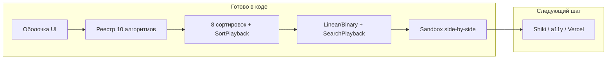

# Состояние AlgoVisual vs ТЗ и roadmap

> Актуализировано: 2026-08-27 · после Step 6 (Sandbox) в коде.

**Режим работы:** staged delivery — один шаг → ревью/commit → отмашка → следующий.

**Важно:** [algovisual_roadmap_6a8cc470](c:\Users\mari_banana\.cursor\plans\algovisual_roadmap_6a8cc470.plan.md) **устарел**. Источник требований: [Перезапуск изучения алгоритмов.md](c:\Users\mari_banana\Documents\GitHub\Перезапуск изучения алгоритмов.md). Handoff сессии: `PROJECT_STATUS.md` в корне репо.

---

## Что требует ТЗ (сжато)

- Учебник с Big O, карточками категорий, страницей `/algorithm/:slug` (визуализатор слева, аккордеон справа, код снизу, кнопка 3D).
- Песочница `/sandbox?a=&b=` — side-by-side сравнение.
- Clean Architecture: чистый TS в `algorithms/`, генераторы шагов, React только рендерит `currentStep`.
- По алгоритму: как работает, Big O, когда использовать, 3 варианта кода, визуализация, тесты.
- Стек: Vite + React + TS + RR7 + Framer Motion + CSS Modules + Shiki + Vitest + Vercel; 3D (R3F) — финал.

---

## Что уже сделано (факты из кода)

**Этап 0 — скелет и дизайн: закрыт**

- Роуты, токены, Layout, Home, Learn, реестр 10 алгоритмов, типы

**Этапы 1–4 — сортировки: закрыты** (закоммичено на `main` @ `6a5b8e9`)

- Все 8 сортировок end-to-end: теория, `howItWorks`, 3 варианта кода, TS, генераторы, тесты
- `SortVisualizer` + `SortPlaybackPanel` + `PlaybackControls` / `Slider`
- UX: `nameRu`, бейджи/tooltips, prev/next, мобильный layout, Home hero bars + scroll cue

**Этап 5 — поиск: код готов** (принят, в working tree)

- `SearchStep`, linear/binary + генераторы + тесты, `SearchVisualizer` / `SearchPlaybackPanel`

**Этап 6 — песочница: код готов, ждёт ревью** (working tree dirty)

- `/sandbox?a=&b=` — два селекта, side-by-side viz, общий input (random + edit)
- Sync playback: ▶ оба / пауза / сброс / общая скорость
- Цель поиска, если выбран searching; binary получает sorted-копию
- Итог сравнения по шагам после завершения обоих
- Тесты: **72/72** passed (`npm test`)

---

## Ещё не сделано

- Commit Steps 5–6 (можно одним или двумя коммитами)
- Shiki в CodeBlock, a11y, финальный адаптив, деплой Vercel
- Полный каталог (структуры, деревья, графы, DP, жадные, строки)
- CSS-арт на карточках + квиз «Угадай сложность»
- 3D (R3F)

---

## Порядок шагов (staged delivery)

1. ~~Закрыть дыру визуализации (MVP)~~
2. ~~Контент: `howItWorks` + аккордеон~~
3. ~~Merge Sort~~
4. ~~Quick / Heap / Radix / Counting + UX~~
5. ~~Linear + Binary + `SearchVisualizer`~~
6. ~~Песочница~~ — **код готов → ревью/commit**
7. Полировка: Shiki, адаптив, a11y, README, Vercel ← **следующий после отмашки**
8. Полный каталог (структуры, деревья, графы, DP, жадные, строки)
9. CSS-арт + квиз «Угадай сложность»
10. **3D (R3F) в конце**

Целевой scope — **роскошный максимум**.

---

## Ключевые решения (не переоткрывать без причины)

| Решение | Зачем |
|---------|--------|
| Domain в `src/algorithms/` без React | Clean Architecture |
| `*PlaybackPanel` как composition root | generator → runner → player → viz |
| Отдельный `SearchStep` (не расширять `SortStep`) | Разная семантика шагов |
| Sandbox: два независимых player + общий speed/input | Как в ТЗ wireframe |
| Binary в sandbox — sorted-копия shared input | Честное предусловие без ломки linear |
| Placeholder, если нет генератора | Будущие категории |
| 3D только в конце roadmap | Не отвлекаться до полного 2D-каталога |

---

## Чек-лист внедрения (остаток)

### Steps 5–6 — закрытие (сейчас)
- [ ] Ревью Search + Sandbox
- [ ] Commit(s) — см. handoff
- [ ] Ручной просмотр `/algorithm/linear-search`, `/binary-search`, `/sandbox?a=bubble-sort&b=quick-sort`
- [ ] Обновить `PROJECT_STATUS.md` после commit

### Step 7 — полировка и деплой
- [ ] Shiki в CodeBlock
- [ ] a11y + финальный адаптив
- [ ] README под Search + Sandbox
- [ ] Деплой Vercel

### Steps 8–10
- [ ] Полный каталог
- [ ] CSS-арт + квиз
- [ ] 3D (R3F)
